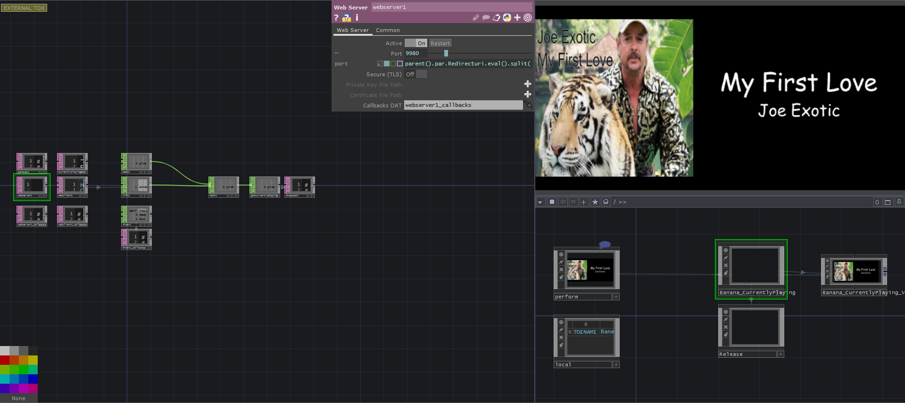

# Banana_CurrentlyPlaying

A simple integration of the Spotify API for learning purpose. It can be used to understand the authentification process and add a small widget to your TouchDesigner streams with the currently playing track, artist and album cover.

## How to setup
### Spotify Developer App
1. You will need first to register a Spotify Developer App as I am not providing Client ID and Client secret
2. Go to https://developer.spotify.com/ and log with your Spotify account
3. Go to [Dashboard](https://developer.spotify.com/dashboard/applications) 
4. Click on the square button My New App / Create an App
5. Once everything is filled, you can see a tile for that app in your Dashboard, click on it and you can now see the ClientID and Client Secret just underneath your app description
6. Save those keys, we will need them later
7. Click on the top right, edit settings, and got to the Redirect URIs section, add something such as `http://localhost:XXXX` where XXXX is a local port that you want to use to link TD and the Spotify API together.
8. Save this link for later as well, including the port.

### Release TOX vs TOE

The component is coming in two flavors, the first is a sample project but also development setup (every file is externalized). 
- At the root of the repository, you can access it from `Banana_CurrentlyPlaying.toe`.
- The second flavor is in the `_RELEASE` folder, you will always find the latest version of the component, without externalization, and (almost) ready for use.

### Using the component for the first time (the TOX way)

When you open the tox for the first time, there is big chances that an error message will appear. Nothing to worry about, you might just be missing some essentials credentials to run the project.

1. In TouchDesigner, fill the parameter of the component called `Redirect URI`, I asked you to save it earlier, remember ?
1. Go back to your Spotify App Dashboard
2. Copy the Client Id
3. Paste it on the TouchDesigner component, in the parameter `Client ID`
4. Do the same for `Client Secret`
5. Pulse the Force Re-Auth parameter

Now, your browser should have a new tab that asks for authentification in your Spotify account. It is normal, Spotify is making sure that you are allowing access to some of your personal information. The token that will be generated is scoped for `user-read-currently-playing` only.

Once you logged in, you should see some fairly ugly message appearing on your screen saying that the link was made. If nothing happens, you might want to pulse again Force Re-Auth. In the background we are using the WebServer DAT from TouchDesigner. I noticed that sometimes it is a bit finicky on startup.

If you look at the TouchDesigner component, the fileds Token and Refresh token should be now filled with values.

You are ready to use the component.

## How to access the exposed data

From anywhere in your TouchDesigner application, type `op.BANANA_CURRENTLYPLAYING.Propertyname`

The properties are:
- Artists - A list of artists on the currently playing track - String - `op.BANANA_CURRENTLYPLAYING.Artists`
- Trackname - The title on the currently playing track - String - `op.BANANA_CURRENTLYPLAYING.Trackname`
- Albumcover - The URL to the image of the album cover of the currently playing track - String - `op.BANANA_CURRENTLYPLAYING.Albumcover`

As long as something is playing from any of your devices (not necessarily local stream, it can be from your phone or Sonos or whatever you like.) then these informations will be updated with a small delay.

When you pause or close Spotify, the values are empty.